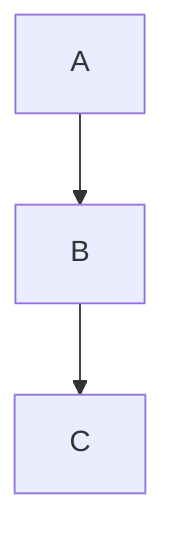
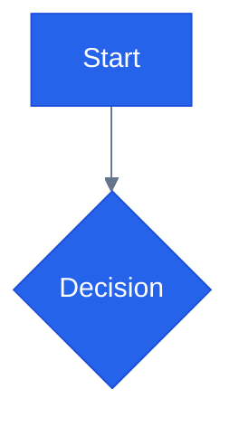
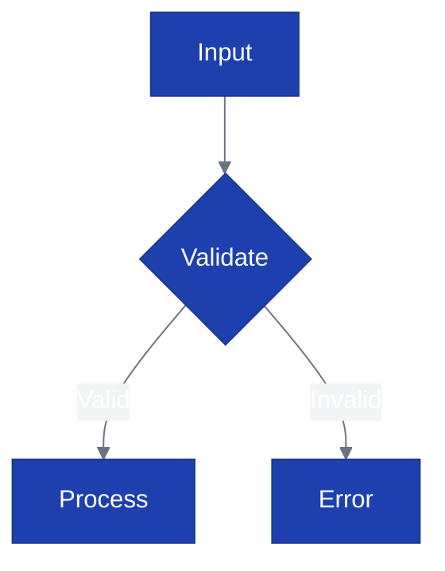
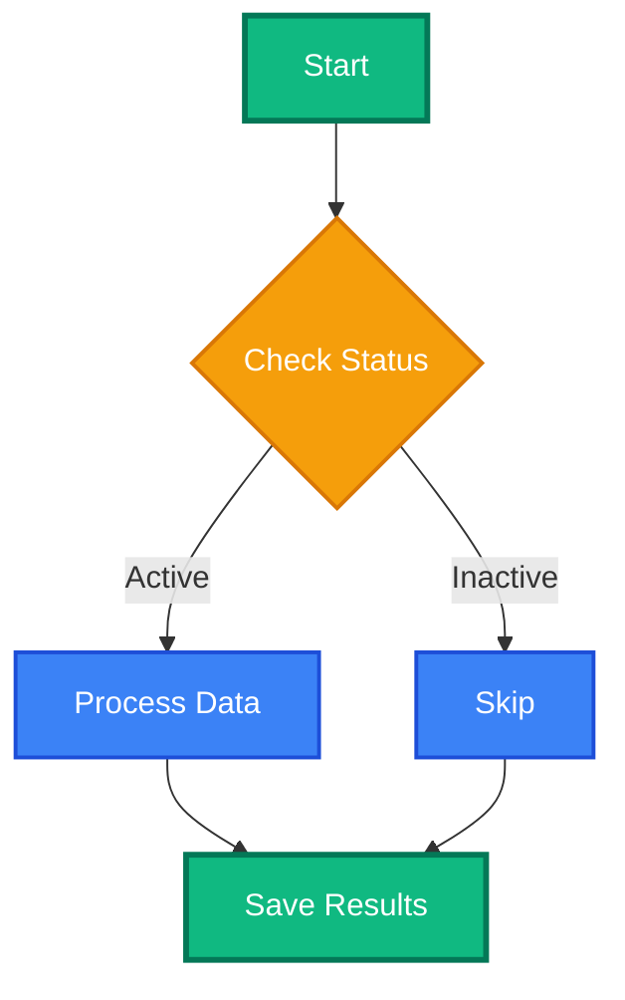
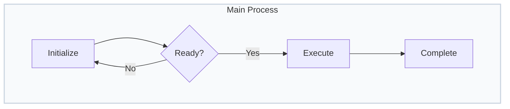
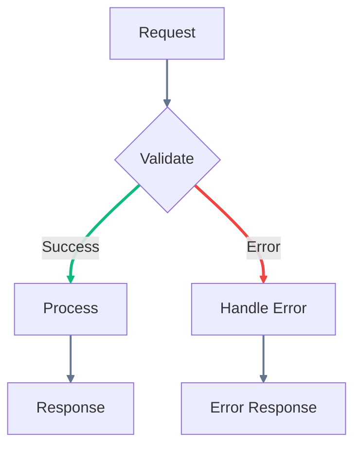

# Mermaid Flowchart Professional Styling

Advanced styling techniques for creating clean, professional flowcharts with consistent visual appearance.

## When to Apply

- Creating business process flows with professional appearance
- Technical diagrams requiring consistent node styling
- Flowcharts needing precise spacing and layout control
- Converting hand-drawn processes to polished digital diagrams

## Critical Rules

**Use classDef for Consistency**: Define reusable style classes instead of individual node styling for scalable, maintainable diagrams.

```mermaid
// WRONG - Individual styling for each node
flowchart TD
A[Process] --> B[Decision]
style A fill:#e1f5fe,stroke:#0277bd,stroke-width:2px
style B fill:#fff3e0,stroke:#ef6c00,stroke-width:2px

// RIGHT - Reusable classes
flowchart TD
A[Process] --> B[Decision]
classDef processNode fill:#e1f5fe,stroke:#0277bd,stroke-width:2px
classDef decisionNode fill:#fff3e0,stroke:#ef6c00,stroke-width:2px
class A processNode
class B decisionNode
```

**Control Spacing with Config**: Use frontmatter configuration to control layout spacing rather than adjusting diagram structure.



**Theme Variables for Professional Colors**: Use base theme with custom themeVariables for consistent professional color schemes.



## Key Patterns

### Professional Color Scheme



### Consistent Node Classes



### Controlled Spacing Layout



### Link Styling for Emphasis



## Common Mistakes

- **Individual node styling** — Use classDef and class assignments for consistency across large diagrams
- **Default spacing** — Configure nodeSpacing and rankSpacing to prevent cramped layouts
- **Random colors** — Use theme-based color schemes with themeVariables for professional appearance
- **Missing subgraph organization** — Group related processes in styled subgraphs for better hierarchy
- **Inconsistent link styling** — Apply linkStyle systematically to create visual flow hierarchy