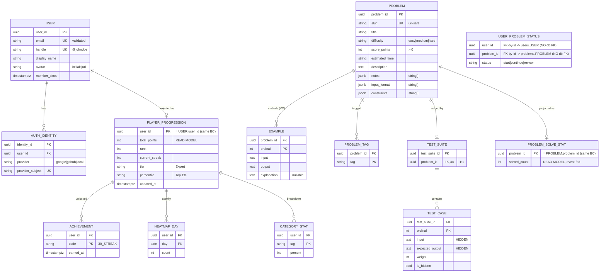

# ER Mapping — Users & Problems

> Physical (persistence) view of [`domain-model.md`](./domain-model.md). Shows how the
> aggregates and read models land in Postgres.
>
> **DDD rule made visible:** no relationship line crosses a bounded context. Cross-context
> links (`user_id`, `problem_id`) are stored as bare values — joined at the BFF, **never** by
> SQL foreign key. That is the "schema boundaries" arrow in the architecture diagram.

## Reading notes

- **No line crosses a schema boundary.** `USER_PROBLEM_STATUS`, `total_points`, `solved_count`
  carry `user_id`/`problem_id` as bare values — joined at the BFF, never by SQL FK.
- **Solid lines = real DB FKs**, only inside one schema (one BC, one Postgres schema).
- **`EXAMPLE` / `PROBLEM_TAG`** — value objects in the domain, but child tables physically
  (collections can't be a single column). `notes` / `input_format` / `constraints` stay `jsonb`
  (ordered string lists, never queried individually).
- **Read models** (`PLAYER_PROGRESSION` + children, `PROBLEM_SOLVE_STAT`) — fed by
  `SubmissionEvaluated`. Rebuildable, not authoritative.
- **`USER_PROBLEM_STATUS`** — Submission BC, out of scope. Shown so the `status` field's true
  home is visible.
