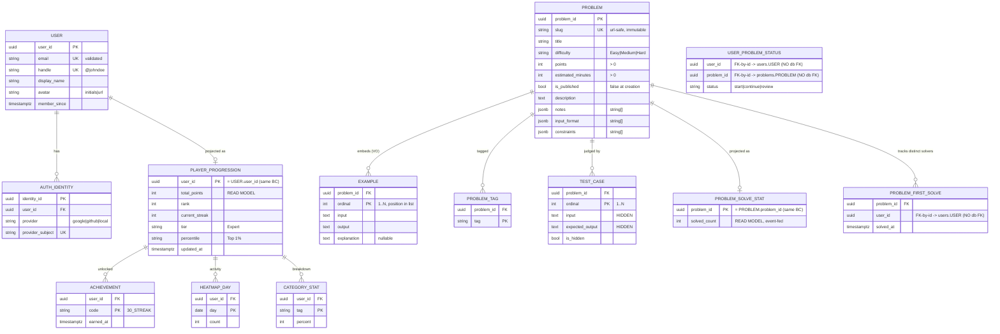

```mermaid
erDiagram
%% ============ USERS BC (schema: users) ============
    USER ||--o{ AUTH_IDENTITY : "has"
    USER ||--o| PLAYER_PROGRESSION : "projected as"
    PLAYER_PROGRESSION ||--o{ ACHIEVEMENT : "unlocked"
    PLAYER_PROGRESSION ||--o{ HEATMAP_DAY : "activity"
    PLAYER_PROGRESSION ||--o{ CATEGORY_STAT : "breakdown"

    USER {
        uuid user_id PK
        string email UK "validated"
        string handle UK "@johndoe"
        string display_name
        string avatar "initials|url"
        timestamptz member_since
    }
    AUTH_IDENTITY {
        uuid identity_id PK
        uuid user_id FK
        string provider "google|github|local"
        string provider_subject UK
    }
    PLAYER_PROGRESSION {
        uuid user_id PK "= USER.user_id (same BC)"
        int total_points "READ MODEL"
        int rank
        int current_streak
        string tier "Expert"
        string percentile "Top 1%"
        timestamptz updated_at
    }
    ACHIEVEMENT {
        uuid user_id FK
        string code PK "30_STREAK"
        timestamptz earned_at
    }
    HEATMAP_DAY {
        uuid user_id FK
        date day PK
        int count
    }
    CATEGORY_STAT {
        uuid user_id FK
        string tag PK
        int percent
    }

%% ============ PROBLEMS BC (schema: problems) ============
    PROBLEM ||--o{ EXAMPLE : "embeds (VO)"
    PROBLEM ||--o{ PROBLEM_TAG : "tagged"
    PROBLEM ||--o{ TEST_CASE : "judged by"
    PROBLEM ||--o| PROBLEM_SOLVE_STAT : "projected as"
    PROBLEM ||--o{ PROBLEM_FIRST_SOLVE : "tracks distinct solvers"

    PROBLEM {
        uuid problem_id PK
        string slug UK "url-safe, immutable"
        string title
        string difficulty "Easy|Medium|Hard"
        int points "> 0"
        int estimated_minutes "> 0"
        bool is_published "false at creation"
        text description
        jsonb notes "string[]"
        jsonb input_format "string[]"
        jsonb constraints "string[]"
    }
    EXAMPLE {
        uuid problem_id FK
        int ordinal PK "1..N, position in list"
        text input
        text output
        text explanation "nullable"
    }
    PROBLEM_TAG {
        uuid problem_id FK
        string tag PK
    }
    TEST_CASE {
        uuid problem_id FK
        int ordinal PK "1..N"
        text input "HIDDEN"
        text expected_output "HIDDEN"
        bool is_hidden
    }
    PROBLEM_SOLVE_STAT {
        uuid problem_id PK "= PROBLEM.problem_id (same BC)"
        int solved_count "READ MODEL, event-fed"
    }
    PROBLEM_FIRST_SOLVE {
        uuid problem_id FK
        uuid user_id "FK-by-id -> users.USER (NO db FK)"
        timestamptz solved_at
    }

%% ============ SUBMISSION BC (out of scope, shown for refs) ============
    USER_PROBLEM_STATUS {
        uuid user_id "FK-by-id -> users.USER (NO db FK)"
        uuid problem_id "FK-by-id -> problems.PROBLEM (NO db FK)"
        string status "start|continue|review"
    }
```
